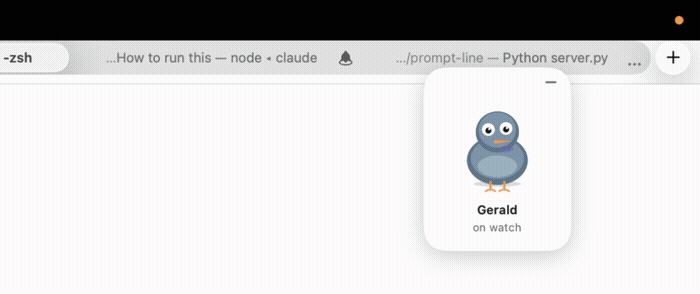
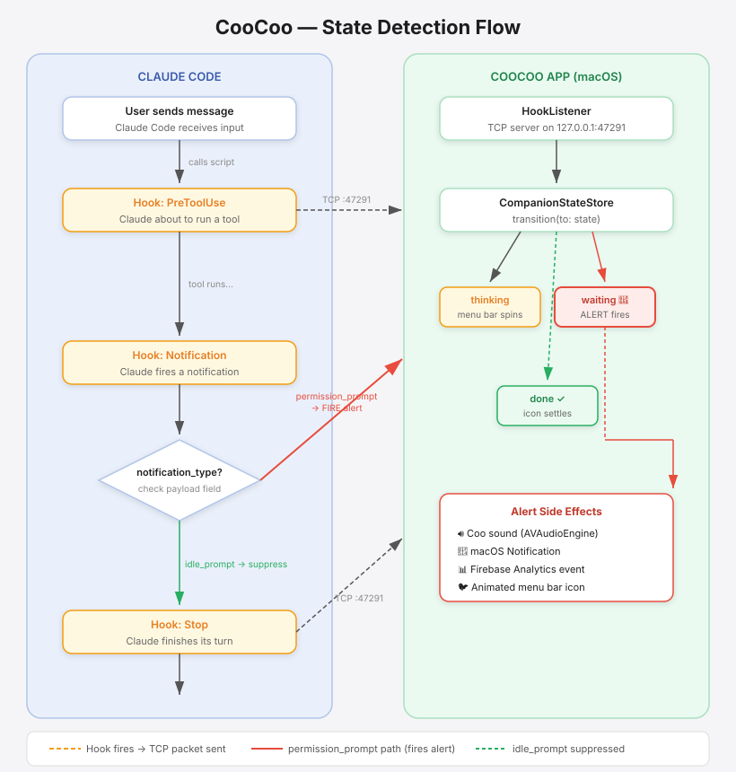
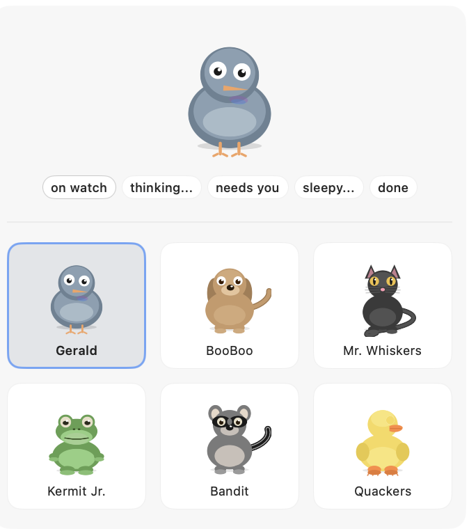

# CooCoo 🐦

> Gerald the pigeon watches Claude Code so you don't have to.

CooCoo sits in your macOS menu bar and alerts you — with a coo sound and notification — the moment Claude Code needs your input.



---

## Download

**[⬇️ Get CooCoo](https://zzunaid.github.io/coo-coo/)**

Requires macOS 14 Sonoma or later + Claude Code installed.

Prefer to skip straight to the file, or build it yourself? [Grab the DMG directly](https://github.com/zzunaid/coo-coo/releases/tag/v1.2.2) from Releases, or see [Building from source](#building-from-source) below.

---

## Install

1. Open `CooCoo.dmg`
2. Drag **CooCoo** into your Applications folder
3. Launch — it lives in your menu bar, no Dock icon

CooCoo auto-installs the Claude Code hooks on first launch. No manual setup needed.

---

## How it works

CooCoo uses **Claude Code's built-in hook system** — not PTY parsing or process watching. Claude Code calls small hook scripts at specific lifecycle events, which send a TCP packet to the CooCoo app running locally.

### State detection

| Hook | When it fires | CooCoo state |
|------|--------------|-------------|
| `PreToolUse` | Claude is about to run a tool | `thinking` — menu bar icon animates |
| `UserPromptSubmit` | You submit a reply | `thinking` — clears the alert instantly, without waiting on Claude's first move |
| `Notification` | Claude fires a notification | `waiting` — alert fires (filtered, see below) |
| `Stop` | Claude finishes its turn | `done` — icon settles |

### Notification filtering

The `Notification` hook fires for all Claude notifications, not just "needs input". CooCoo filters by the `notification_type` field in the hook payload:

- `permission_prompt` → **fire alert** (Claude needs you to approve a tool call)
- `idle_prompt` → **suppress** (Claude just finished a turn, not urgent)

### Flow chart



### Architecture

```
Claude Code hooks (~/.claude/settings.json)
    └── coocoo-notify.py (Python hook script)
            └── JSON payload → TCP 127.0.0.1:47291
                    └── HookListener (Swift, runs inside CooCoo)
                            └── CompanionStateStore.transition(to:)
                                    ├── Animated menu bar icon (12fps, NSStatusItem)
                                    ├── Coo sound (AVAudioEngine)
                                    ├── macOS notification (UNUserNotificationCenter)
                                    └── Firebase Analytics event
```

All communication is local — no internet required for the core alerting feature.

---

## Characters



## Features

- **6 characters** to choose from: Gerald (pigeon), Mr. Whiskers (cat), Quackers (duck), Kermit Jr (frog), BooBoo (dog), Bandit (raccoon)
- **Animated menu bar icon** — changes appearance based on Claude's state
- **Sound alert + macOS notification** when Claude needs you
- **Floating widget** — drag anywhere on screen, persists position
- **Preferences** — character picker, sound volume, widget toggle
- **Auto-installs hooks** on first launch — no manual configuration
- **Login item** — launches automatically when you log in

---

## Privacy

- No data leaves your machine for core functionality
- Firebase Analytics is used to understand basic usage (app launches, state changes, character selections). You can review the analytics code in [`Analytics.swift`](coo-coo/coo-coo/Analytics.swift).
- Hook scripts run locally and log to `~/.coocoo/hook.log`

---

## Requirements

- macOS 14 Sonoma or later
- [Claude Code](https://claude.ai/code) installed and configured

---

## Building from source

```bash
git clone https://github.com/zzunaid/coo-coo.git
cd coo-coo/coo-coo
open coo-coo.xcodeproj
```

You'll need to add your own `GoogleService-Info.plist` from Firebase (or remove the Firebase dependency from the project if you don't need analytics).

---

## License

MIT
